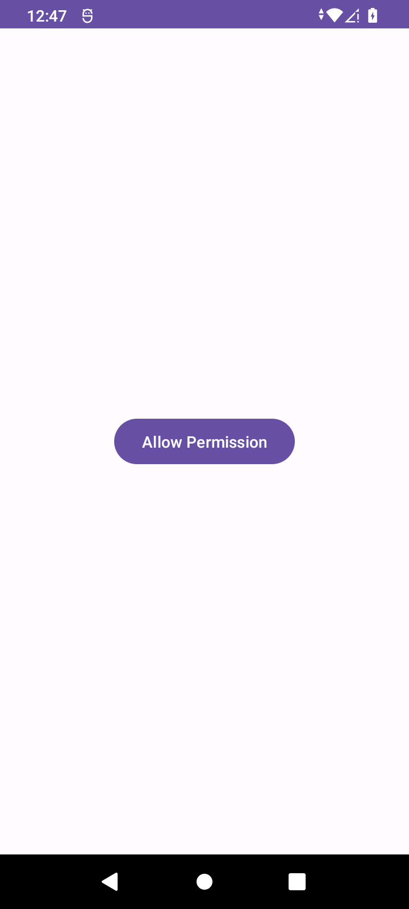
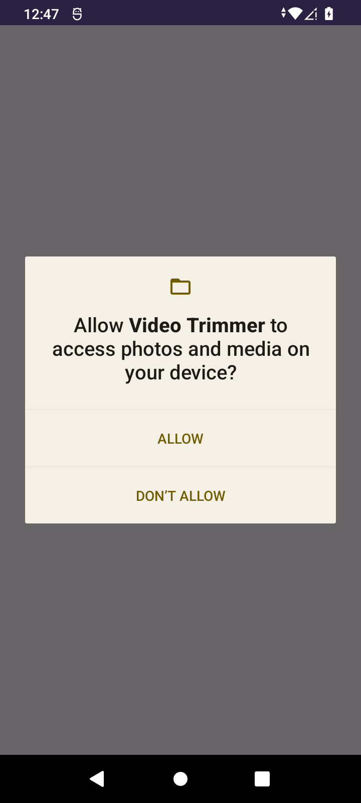
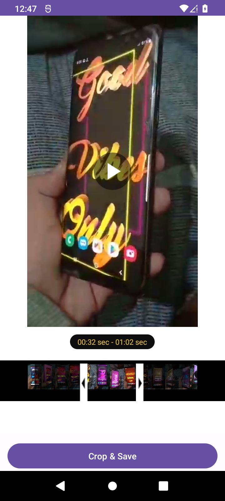
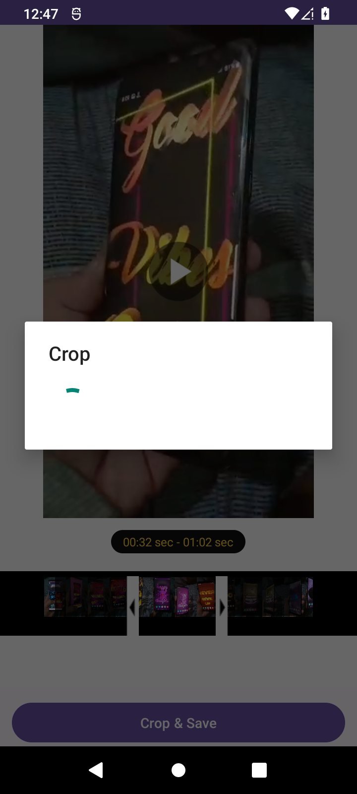
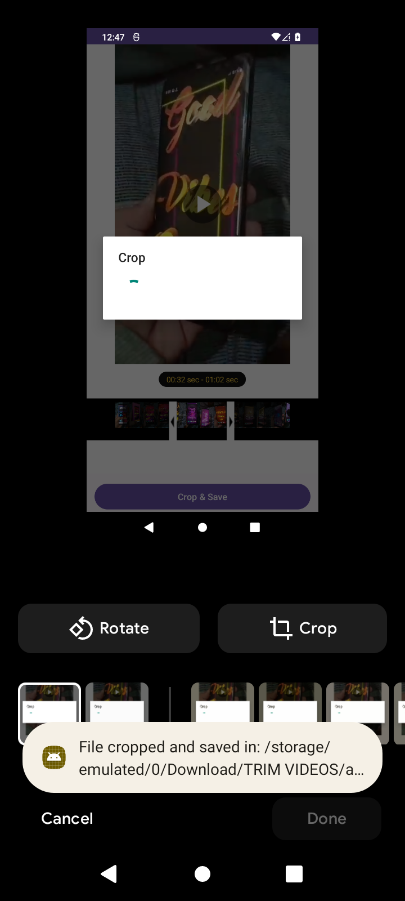

# Video-Trimmer
An open-source Kotlin Android Studio project that offers WhatsApp-like video trimming, allowing precise edits with a sleek user interface for seamless video customization on your Android device.

# ScreenShots

 

# Features
Trim videos to a specified length.
Simple and intuitive user interface.
Allows users to grant read external storage permission for video selection.
Supports various video formats.

# Usage
# Allow Permission

Upon launching the app, you'll be prompted to grant "Read External Storage" permission. Click the "Allow Permission" button to proceed.
# Select Video

After granting permission, the app will display a list of videos available on your device.
# Trim Video

Select the video you want to trim from the list. The selected video will be loaded into the video player.

Use the sliders to set the start and end points of the desired trim.

Preview the trimmed video to ensure it meets your requirements.

# Save Trimmed Video

Once satisfied with the trim, click the "Save Trimmed Video" button. The trimmed video will be saved to your device.
